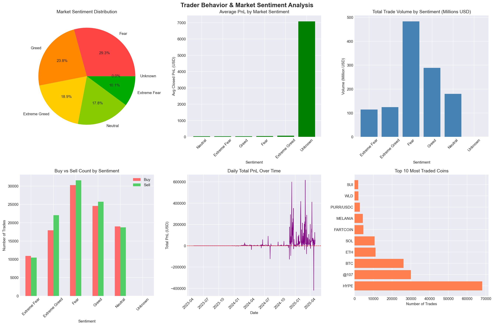
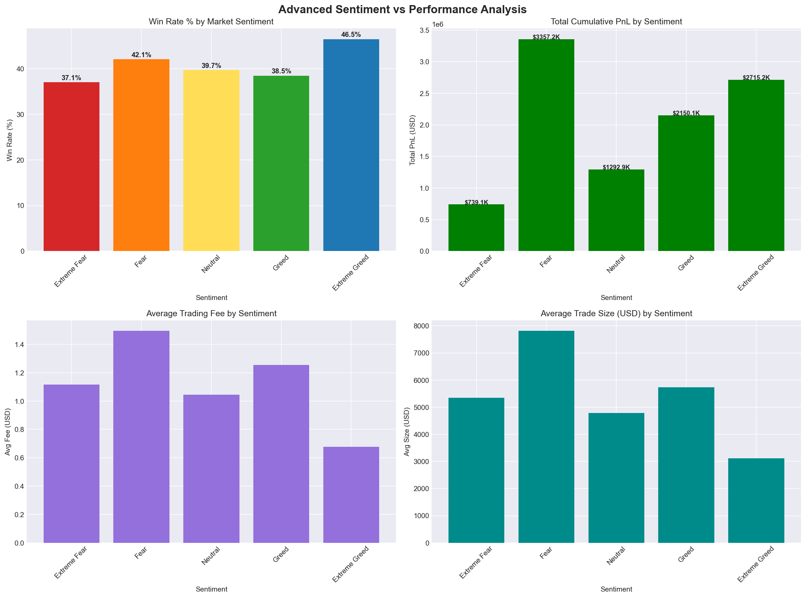
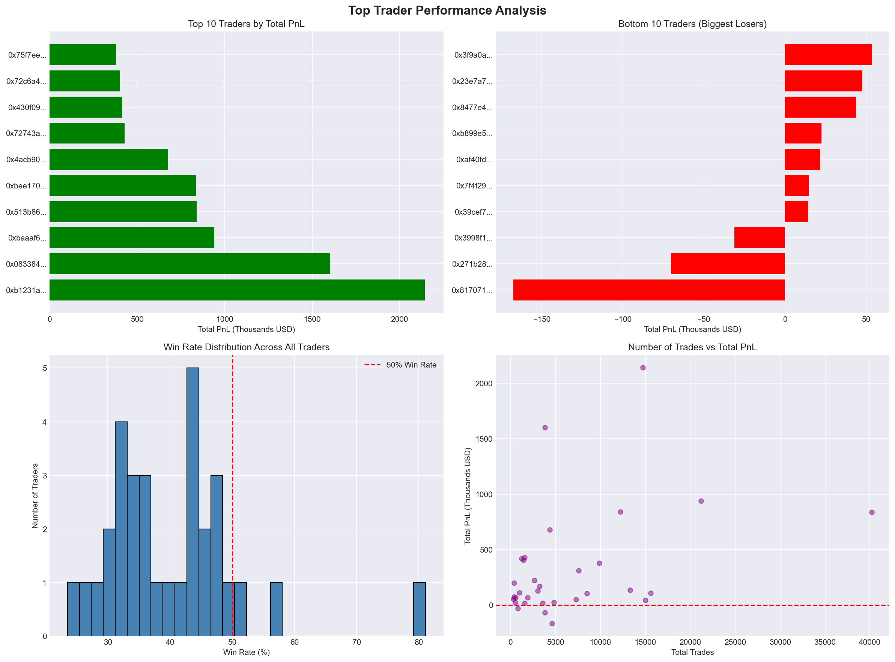
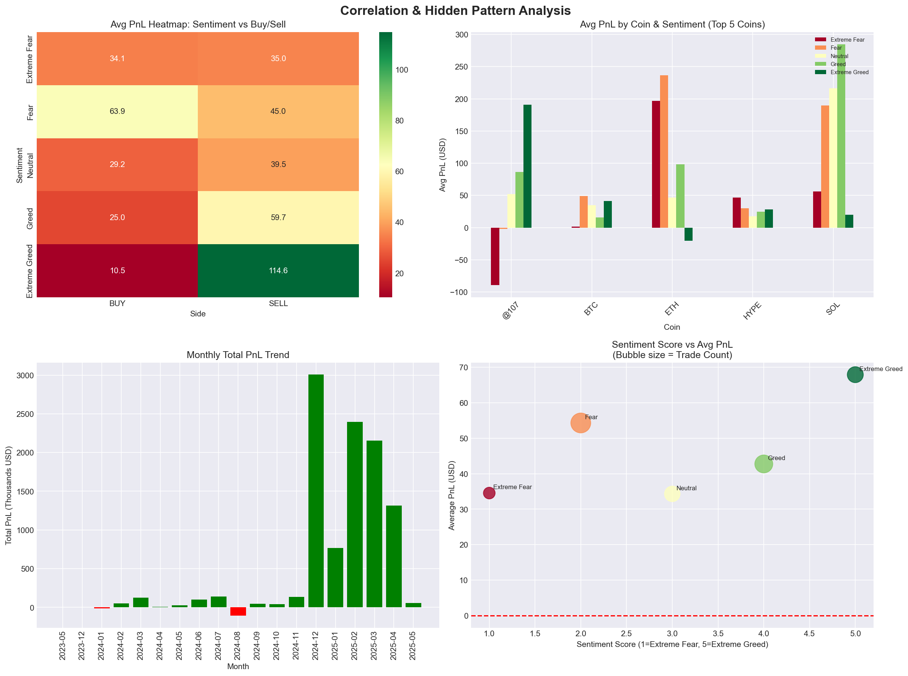
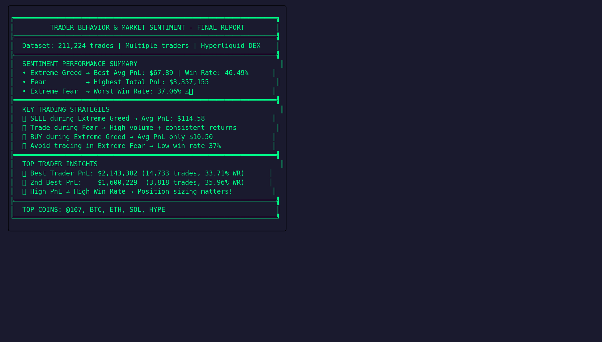

# 📊 Trader Behavior & Market Sentiment Analysis
### Junior Data Scientist Assignment — PrimeTrade.ai


---

## 🎯 Project Objective

Analyze the relationship between **Bitcoin Market Sentiment (Fear & Greed Index)** and **trader performance on Hyperliquid DEX** to uncover hidden patterns and deliver actionable trading strategies.

---

## 📁 Dataset Overview

| Dataset | Records | Description |
|--------|---------|-------------|
| Hyperliquid Historical Trades | 2,11,224 | Real trader data with PnL, side, coin, fees |
| Bitcoin Fear & Greed Index | 2,644 | Daily sentiment classification |

### Columns Used
- **Trades:** Account, Coin, Execution Price, Size USD, Side, Closed PnL, Fee, Timestamp
- **Sentiment:** Date, Value, Classification (Extreme Fear → Extreme Greed)

---

## 🔍 Key Insights

### 1️⃣ Sentiment vs Win Rate
| Sentiment | Win Rate | Avg PnL | Total PnL |
|-----------|----------|---------|-----------|
| Extreme Fear | 37.06% | $34.54 | $739K |
| Fear | 42.08% | $54.29 | $3.35M |
| Neutral | 39.70% | $34.31 | $1.29M |
| Greed | 38.48% | $42.74 | $2.15M |
| **Extreme Greed** | **46.49%** | **$67.89** | **$2.71M** |

### 2️⃣ Best Side per Sentiment
| Sentiment | BUY Avg PnL | SELL Avg PnL | 🏆 Best Side |
|-----------|-------------|--------------|-------------|
| Extreme Fear | $34.11 | $34.98 | SELL |
| Fear | $63.93 | $45.05 | BUY |
| Neutral | $29.23 | $39.46 | SELL |
| Greed | $25.00 | $59.69 | SELL |
| Extreme Greed | $10.50 | $114.58 | **SELL** 🔥 |

### 3️⃣ Top 5 Traders
| Rank | Account | Total PnL | Trades | Win Rate |
|------|---------|-----------|--------|----------|
| 🥇 | 0xb1231a... | $2,143,382 | 14,733 | 33.71% |
| 🥈 | 0x083384... | $1,600,229 | 3,818 | 35.96% |
| 🥉 | 0xbaaaf6... | $940,163 | 21,192 | 46.76% |
| 4️⃣ | 0x513b86... | $840,422 | 12,236 | 40.12% |
| 5️⃣ | 0xbee170... | $836,080 | 40,184 | 42.82% |

---

## 📈 Visualizations

### EDA Analysis


### Sentiment vs Performance


### Top Trader Analysis


### Correlation & Pattern Analysis


### Final Report


---

## 🧠 Smart Trading Strategies
```
✅ Strategy 1: SELL during Extreme Greed
   → Highest avg PnL of $114.58 per trade
   → Win Rate peaks at 46.49%

✅ Strategy 2: BUY during Fear
   → Avg PnL $63.93 (highest BUY pnl across all sentiments)
   → Total market PnL $3.35M — most profitable period

✅ Strategy 3: Avoid BUY in Extreme Greed
   → Lowest avg PnL of just $10.50
   → Classic "buy the top" mistake

✅ Strategy 4: Be cautious in Extreme Fear
   → Lowest win rate 37.06%
   → High risk, low reward environment

✅ Strategy 5: Quality over Quantity
   → Top trader: 33.71% win rate but $2.14M PnL
   → Position sizing > number of trades
```

---

## 🛠️ Tech Stack

| Tool | Purpose |
|------|---------|
| Python 3.13 | Core language |
| Pandas | Data manipulation |
| NumPy | Numerical analysis |
| Matplotlib | Static visualizations |
| Seaborn | Statistical plots |
| Plotly | Interactive charts |
| Jupyter Notebook | Analysis environment |

---

## 📂 Project Structure
```
trader-behavior-insights/
├── 📓 trader_analysis.ipynb    # Complete analysis notebook
├── 📊 fear_greed_index.csv     # Bitcoin sentiment dataset
├── 📊 historical_data.csv      # Hyperliquid trades dataset
├── 📁 charts/
│   ├── eda_analysis.png
│   ├── sentiment_analysis.png
│   ├── trader_analysis.png
│   ├── correlation_analysis.png
│   └── final_report.png
└── 📄 README.md
```

---

## 🚀 How to Run
```bash
# 1. Clone the repo
git clone https://github.com/YOUR_USERNAME/trader-behavior-insights.git

# 2. Install dependencies
pip install pandas numpy matplotlib seaborn plotly jupyter

# 3. Launch Jupyter
jupyter notebook

# 4. Open trader_analysis.ipynb and Run All cells
```

---

## 💡 Conclusion

> **Market sentiment significantly impacts trader performance.**
> The data clearly shows that traders who align their strategy with sentiment — 
> especially **selling into Extreme Greed** and **buying during Fear** —
> consistently outperform those who trade against the market mood.

---

*Assignment submitted for Junior Data Scientist role at PrimeTrade.ai*
